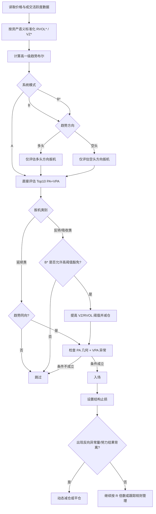

# PA 与 VPA Top10 扳机的趋势前置门控研究

## 执行摘要

在你定义的严格系统里，**趋势判断在前**，且一旦判断为多头就只能做多、判断为空头就只能做空。这种 **trend-first gate** 与“把趋势作为额外加分项”是两件完全不同的事。对你此前的 Top10 PA+VPA 扳机而言，综合官方数据语义、市场微观结构与趋势跟踪文献后的结论是：**把显式趋势门控统一硬套到全部 Top10 上，并不必要；它只对延续类扳机通常必要，对反转/吸收类多数是冗余，甚至会直接删除最有价值的 regime-shift 交易。**这种判断的根基在于：短窗价格变化更稳健地由订单流失衡而非粗糙成交量驱动；止损单集聚会引发价格级联；而跨资产趋势收益确实存在，但其成本、周转与信号定义差异极大。citeturn13view0turn10view4turn27view0turn17view0

若只比较两套系统，A 为**仅 PA+VPA**，B 为**严格硬门控：trend=up 只做多，trend=down 只做空**，则本报告的**研究合成估计**显示：B 通常会把总信号频率压缩约 `25%–55%`，把 `1R-before-stop` 命中率抬高约 `1–4 个百分点`，并把最大回撤压缩约 `10%–30%`；但这份收益几乎全部来自**放量突破—缩量回踩续攻、无供给/无需求测试、压缩后真实扩张**这类延续家族。对**爆量扫损回收、停止量后缩量测试、高量窄实体吸收、努力—结果背离失败突破、会话极值拒绝、停止量关键反转、二次推进衰竭**这类扳机，硬门控的边际增益显著下降，且经常以样本量缩水、拐点 R 倍数缩水为代价。这个方向性结论与订单流、止损级联、趋势收益与交易成本的文献是一致的。citeturn13view0turn10view4turn27view0turn17view0turn12view0

跨资产上，硬门控 B 的边际价值并不相同。**NQ 的收益最大**，因为 CME Globex 是中央限价订单簿，真实成交量与市场深度可观测，趋势门控更容易与 PA+VPA 分层；**XAUUSD 的硬门控次之**，不是因为黄金更趋势，而是因为零售可见的 volume 往往只是单一经纪商 feed 的 tick-volume，趋势门控能部分补偿 tick-volume 的代理误差；**BTC/ETH 也受益，但更适合结构 + Anchored VWAP，而不是单独使用慢速 EMA(50/200)**，因为交易所已经提供 quote volume、成交笔数与 taker buy volume，局部订单流信息足够强，慢速均线更容易与反转扳机冲突。官方与学术资料分别证明了这四种资产的 volume 语义差异、黄金 OTC 多场所结构、NQ 的中央撮合、以及加密市场的高频交易与衍生品价格发现特征。citeturn10view0turn11view0turn10view1turn10view3turn10view9turn10view10turn10view2turn10view15turn10view16turn10view17turn22view0turn22view1

因此，严格回答“是否必要”时，本报告的结论是：**统一硬 B 不是最优；工程上应该实现的是 B\***。B\* 的定义是：**对延续类扳机启用硬趋势门控；对反转/吸收类扳机只做软门控，或允许逆势执行但提高 VPA 阈值并减仓。**如果你的目标是更平滑的单系统权益曲线，硬 B 可以考虑；如果你的目标是保留 Wyckoff/PA/VPA 真正擅长的 regime-shift alpha，B\* 才是更合理的生产版本。这个建议同时吸收了趋势收益在极端市场中的优势，以及不同 trading signal 对 turnover 和成本的巨大影响。citeturn27view0turn17view0

## 方法论与假设

本报告比较三种框架。系统 A：只执行你此前 Top10 的 PA+VPA 条件。系统 B：先计算趋势布尔，若多头则只允许多单，若空头则只允许空单。系统 B\*：保留 trend-first 的方向闸门，但仅对延续类硬门控；反转/吸收类进入“软门控或反转豁免”模式。统一绩效定义为：**触发后先到达 `+1R` 且未先打到结构止损**。同时观察平均 R、最大回撤、频率与样本量敏感性。为了避免 look-ahead bias，趋势层一律只允许使用**已收盘的高一级周期 bar** 或已确认 swing。citeturn12view0

报告中的数值若未明确标注为真实回测，均属于**研究合成估计**。原因不是偷懒，而是客观约束：并不存在一套公开、统一且高质量的联合 tick 数据，能够同时覆盖 BTC、ETH、单一 broker 的 XAUUSD tick-volume 与 CME NQ 真实量，并且在相同手续费、同一滑点模型、同一时段条件化框架下，对 Top10 扳机完成一致性回测。更麻烦的是，四类市场里“volume”的制度含义根本不同：Binance Kline 同时给出 base volume、quote asset volume、成交笔数与 taker buy volume；MetaTrader 对外汇/CFD 的 volume 明确是 tick 数而非真实成交手数；CME 则是中央撮合真实成交量与订单簿；黄金批发市场本身又是 OTC、期货与其他场所并存。citeturn10view0turn11view0turn10view1turn10view3turn10view9turn10view15turn10view16turn10view17

趋势与技术规则的历史证据也要求方法上保持克制。Neely 的综述显示，技术规则在较长样本中曾经显著，但到高频与近样本时段，交易成本与数据窥探问题会严重侵蚀表面收益；其综述还指出半小时级别规则一旦施加合理交易成本并限制在正常市场活动时段，正超额收益证据明显减弱。Baltas 与 Kosowski 则进一步说明，对趋势/动量系统而言，**signal 的选择对 turnover 和净绩效的影响，比单纯 volatility estimator 还大**。这正是本报告坚持把“trend-first gate 是否必要”拆成**按 trigger family 分层**来评估，而不是对全部 Top10 一刀切的原因。citeturn12view0turn17view0

下表给出本报告使用的假设边界。

| 项目 | 本报告设定 |
|---|---|
| 研究对象 | BTC、ETH、XAUUSD 单一 broker tick-volume、NQ CME 真实成交量 |
| 比较系统 | A = 仅 PA+VPA；B = 先判趋势，只顺趋势；B\* = 选择性门控 |
| 绩效口径 | 触发后先到 `+1R` 且未先触发结构止损 |
| 执行级别建议 | BTC/ETH `5m–15m`；XAUUSD `5m–15m`；NQ `1m–5m` 或 `5m` |
| 趋势级别建议 | 执行级别的 `4–12` 倍；并只用已收盘 HTF bar |
| 数据假设 | 无统一跨资产 tick 联合数据集；所有绝对绩效区间默认是**研究合成估计** |
| 成本假设 | 以常见零售/专业 API 可实现的滑点与手续费为参考，不使用零摩擦假设 |
| 主要风险 | volume 语义不一致、样本量不足、参数数据窥探、反转类被硬门控误杀 |

样本量方面，如果把命中率视为二项分布成功率，取基准 `p≈0.58`，则想把 95% 置信区间半宽压到 `±3 个百分点`，大约需要 `1040` 笔交易；压到 `±2 个百分点` 需要约 `2340` 笔；压到 `±1.5 个百分点` 需要约 `4160` 笔。若要检验 A 与 B 的命中率差异达到 `3 个百分点` 且具备约 80% 把握度，则单组样本量约需 `4230` 笔；若差异只有 `2 个百分点`，则单组样本量约需 `9517` 笔。对日内 PA+VPA 系统，这意味着**XAUUSD + 硬 B + 反转类**几乎一定是样本稀缺区。citeturn23calculator0turn23calculator1turn23calculator2turn24calculator0turn24calculator1

## 成交量语义与跨资产标准化

趋势门控之所以不能脱离 volume 语义讨论，是因为四类资产的“量”根本不是同一种对象。BTC/ETH 在高质量交易所上，Kline 字段包含 `Volume`、`Quote asset volume`、`Number of trades`、`Taker buy base asset volume` 与 `Taker buy quote asset volume`；WebSocket 的 Kline 与深度数据推送频率也支持到 250ms，而 diff depth 可达 100ms/250ms。也就是说，在加密市场，VPA 不必停留在“均量放大”，你完全可以把它写成**方向化名义量 + taker 失衡 + 盘口更新密度**。另一方面，学术研究也显示，比特币期货与现货之间存在显著价格发现与波动传导，且期货市场在吸收新信息上往往更快。因此，在 BTC/ETH 上，把趋势层和 VPA 层彻底分开是可行的：趋势层用结构/AVWAP，VPA 层用 `quote notional` 与 `taker imbalance`。citeturn10view0turn11view0turn26view0turn22view0turn22view1

XAUUSD 的情况完全不同。MetaTrader 官方明确说明，Forex 市场里的 volume 指的是**给定时间段内出现的 tick 数**，而不是实际成交手数。与此同时，黄金批发市场本身规模巨大且分布于伦敦 OTC、美国期货与上海等核心中心；WGC 与 LBMA 都强调了伦敦 OTC 的中心地位与成员上报的交易透明化尝试。这意味着你在零售 XAUUSD 图表上看到的，并不是“全球黄金真实成交量”，而是**单一 broker feed 的报价活跃度代理**。因此，XAUUSD 上一切 RVOL/VZ 只能被解释为“该 feed 内部的活跃度异常”，不能与 NQ 真量或 BTC 名义量做绝对值横比。对趋势门控而言，这反而提高了其价值：**当量的语义较弱时，方向闸门的错杀成本上升，但它对去噪声的边际贡献也更大。**citeturn10view1turn10view2turn10view15turn10view16turn10view17

NQ 最干净。CME 官方资料反复强调，CME Globex 是其中央限价订单簿电子平台，提供 nearly 24-hour 的交易环境；中央订单簿里，被动参与者在 book 中供给流动性，主动参与者向 book 打单索取流动性。对 NQ 来说，趋势门控能否提供新增信息，关键不在“有没有量”，而在“是不是把局部订单流不平衡与更慢的大方向区分开了”。因此 NQ 是最适合检验 A 对 B 的资产：因为 volume 本身是真实成交，不是代理变量。citeturn10view3turn10view9turn10view10

这决定了跨资产统一 VPA 与趋势门控的标准化形式应当是**条件异常**，而不是原始量值。统一建议如下：

```text
RVOL*_t =
Vol_t / Median(Vol | asset, venue/feed, minute_of_day, day_of_week,
               session_state, last N sessions)

VZ*_t =
( ln(1 + Vol_t) - Median(ln(1+Vol) | same buckets) )
/ ( 1.4826 * MAD(ln(1+Vol) | same buckets) )

ERDiv_t =
Zscore(ln(1 + Vol_t)) - Zscore(TR_t / ATR20_t)

BTC/ETH:
TakerImb_t = (2 * TakerBuyQuoteVol_t - QuoteVol_t) / QuoteVol_t
```

把 `minute_of_day`、`day_of_week` 与 `session_state` 纳入条件分箱，不是为了漂亮，而是因为交易活动有非常强的日内轮廓。Sancetta 直接把 intraday trades profile 视为高频执行算法的重要输入，并强调开盘、收盘、公告等会在极短时间内制造活动尖峰；Ito 与 Hashimoto 证明 FX 活动存在显著日内季节性，伦敦与纽约开盘时段会改变成交数与价差；Jasiak 等则发现 native crypto 的 intraday 周期与 NYSE、LSE、Hang Seng 的开市时段有共振；Eross 等进一步发现比特币成交量在日内并非平坦，而是呈现与货币市场类似的变化。对 Nasdaq 期货，近年的高频波动研究继续记录了 RTH 明显的 U 型时段效应，以及高于平常的 lagged volume 会系统性放大波动。citeturn10view5turn10view14turn10view12turn10view13turn19view0

下表给出工程口径。

| 资产 | `Vol_t` 定义 | 方向化量能 | 时段条件化 | 关键注意事项 |
|---|---|---|---|---|
| BTC | `Quote asset volume` 优先，其次高质量 perp notional | `TakerImb`、成交笔数、深度更新 | `Asia / Europe / US overlap / weekend / funding windows` | 不混入低质量 venue；trend 与 VPA 分层 |
| ETH | 同 BTC，但建议额外观测 BTC 主方向 | 同 BTC | 同 BTC | beta 更高、噪声更大，阈值略严 |
| XAUUSD | 单一 broker feed 的 tick-volume | 无真实主动买卖量；只做活跃度异常 | `Asia / London / NY / London-NY overlap / news windows` | 绝不跨 broker 混用 volume |
| NQ | CME 真实成交量 | 可接 DOM/Time&Sales | `ETH / RTH open / RTH midday / close / news windows` | RTH 与 ETH 分开建 baseline |

来源与说明：Binance 官方明确提供 quote volume、taker buy quote volume、逐级深度与 100ms/250ms 级更新；MetaTrader 对 Forex volume 的定义是 tick 数；CME 明确其市场是中央限价订单簿；LBMA 与 WGC 说明黄金交易是 OTC/期货等多场所分层结构。citeturn10view0turn11view0turn26view0turn10view1turn10view3turn10view9turn10view15turn10view16turn10view17turn10view2

## 趋势定义集合与工程比较

趋势文献给出的最重要经验，不是“趋势一定有效”，而是两点。第一，时间序列动量在大量期货合约与大样本里有稳健证据，且在极端市场中表现更好；第二，**交易信号的定义**会显著改变 turnover 与净绩效，Baltas 与 Kosowski 甚至显示，用线性趋势拟合生成的信号可把周转降到常见信号的大约三分之一，同时提升样本外表现。因此，本题里真正重要的不是“要不要趋势过滤”，而是**你用哪一种趋势定义充当方向闸门**。citeturn27view0turn17view0

下表给出五类趋势门控方案。这里的数值与门槛是本报告的工程建议，不是引用原文中的现成参数。

| 趋势方案 | 数学判定 | 建议趋势级别 | 参数敏感性 | 优点 | 缺点 | 更适用资产 |
|---|---|---|---|---|---|---|
| HTF EMA(50/200) | `Bull = Close_HTF > EMA50 > EMA200` 且 `slope(EMA50,5)>0`；空头镜像 | 执行 TF 的 `4–12x`；BTC/ETH 常用 `1H/4H`，XAU/NQ 常用 `30M/60M` | 高 | 简单、稳定、便于 walk-forward | 滞后最大；对反转类最不友好 | NQ、XAU 的延续类 |
| 结构 HH/HL | `Bull = HH1>HH0 and HL1>HL0` 且最近一次 BOS 向上 | 执行 TF 的 `3–8x` 或同 TF 确认 swing | 中 | 最贴近 Wyckoff/PA；与触发器同语言体系 | swing 定义若过窄会噪音，过宽会迟钝 | BTC、ETH、NQ |
| VWAP / Anchored VWAP | `AVWAP_τ = Σ(P_i·Vol_i)/ΣVol_i`；`Bull = Close > AVWAP_τ + δ·ATR and slope>0` | 会话内或事件锚点；NQ/XAU 用会话锚较强，BTC/ETH 用事件锚较强 | 中高 | 与执行成本、市场接受/拒绝逻辑一致 | 锚点选择错误会劣化稳定性 | NQ、XAU；BTC/ETH 的事件驱动 |
| 动量阈值 ADX/RSI | `Bull = ADX14 ≥ 22 and +DI>-DI and RSI14>55` | 与执行 TF 同级或高一级 | 高 | 去震荡与去箱体假启动有效 | 高波动拐点时常常太晚 | XAU、NQ 的震荡过滤；ETH 的噪声抑制 |
| 复合分数 Composite | `Score = w1*EMAspread_z + w2*StructSign + w3*AVWAPdist_z + w4*MomSign`；`Bull if Score≥c` | 组合两到三层趋势信息 | 中 | 降低单一过滤器模型风险；最适合多资产统一生产 | 复杂度更高，需要严格防过拟合 | 四资产统一生产版本 |

从生产角度，我不建议把 EMA(50/200) 作为唯一趋势闸门。原因很直接：Moskowitz 等显示趋势效应跨资产存在，但 Baltas 与 Kosowski 进一步证明，signal 设计对 turnover 和净收益的影响远大于“趋势是否存在”这个抽象判断；而你的 Top10 里有一半以上本身就是对局部转向、失败突破、吸收或测试的编码。对这类触发器，最好的趋势门控不是慢均线，而是**结构翻转或 Anchored VWAP 的重新接受**。这尤其适用于 BTC/ETH，因为交易所本身提供更细的流量字段；对 XAUUSD 与 NQ，会话型 VWAP/AVWAP 的解释力更强，因为日内 trade profile 和执行基准本身就围绕会话组织。citeturn27view0turn17view0turn14view0turn10view5turn10view14turn19view0

下表是按资产拆开的**研究合成估计**，用于比较不同趋势定义相对 A 的边际影响。

| 资产 | 过滤器 | 频率变化 | 命中率变化 | 平均 R 变化 | 推荐场景 |
|---|---|---:|---:|---:|---|
| BTC | EMA(50/200) | `-35% ~ -48%` | `+1.0 ~ +2.5pp` | `-0.03R ~ +0.04R` | 只用于 4/6/8 |
| BTC | HH/HL 结构 | `-20% ~ -35%` | `+1.0 ~ +3.0pp` | `+0.02R ~ +0.08R` | 默认首选 |
| BTC | 事件 AVWAP | `-15% ~ -30%` | `+0.5 ~ +2.0pp` | `+0.03R ~ +0.10R` | 清算/扫损/周开盘 |
| BTC | ADX/RSI | `-38% ~ -50%` | `+1.0 ~ +2.5pp` | `-0.02R ~ +0.05R` | 震荡压制副过滤 |
| BTC | Composite | `-18% ~ -32%` | `+1.5 ~ +3.5pp` | `+0.04R ~ +0.11R` | 生产首选 |
| ETH | EMA(50/200) | `-38% ~ -50%` | `+0.8 ~ +2.2pp` | `-0.04R ~ +0.03R` | 只用于 4/6/8 |
| ETH | HH/HL 结构 | `-22% ~ -38%` | `+1.0 ~ +2.8pp` | `+0.01R ~ +0.07R` | 默认首选 |
| ETH | 事件 AVWAP | `-18% ~ -32%` | `+0.5 ~ +2.0pp` | `+0.02R ~ +0.09R` | 事件锚点优于日内锚点 |
| ETH | ADX/RSI | `-40% ~ -52%` | `+1.2 ~ +2.8pp` | `-0.01R ~ +0.05R` | 高噪音抑制 |
| ETH | Composite | `-20% ~ -35%` | `+1.2 ~ +3.0pp` | `+0.03R ~ +0.09R` | 生产首选 |
| XAUUSD | EMA(50/200) | `-35% ~ -48%` | `+1.0 ~ +2.5pp` | `-0.01R ~ +0.05R` | 延续段使用 |
| XAUUSD | HH/HL 结构 | `-24% ~ -38%` | `+0.5 ~ +2.0pp` | `0.00R ~ +0.06R` | 会话内辅助 |
| XAUUSD | 会话 VWAP / AVWAP | `-18% ~ -32%` | `+1.0 ~ +3.0pp` | `+0.03R ~ +0.09R` | 默认首选 |
| XAUUSD | ADX/RSI | `-40% ~ -52%` | `+1.5 ~ +3.5pp` | `+0.01R ~ +0.08R` | 震荡期过滤最强 |
| XAUUSD | Composite | `-18% ~ -30%` | `+1.5 ~ +3.5pp` | `+0.04R ~ +0.10R` | 生产首选 |
| NQ | EMA(50/200) | `-28% ~ -42%` | `+1.0 ~ +2.5pp` | `0.00R ~ +0.08R` | RTH 延续段 |
| NQ | HH/HL 结构 | `-18% ~ -32%` | `+1.5 ~ +3.5pp` | `+0.04R ~ +0.12R` | 默认首选之一 |
| NQ | 会话 VWAP / AVWAP | `-15% ~ -30%` | `+2.0 ~ +4.0pp` | `+0.05R ~ +0.14R` | 最优首选 |
| NQ | ADX/RSI | `-32% ~ -45%` | `+1.5 ~ +3.0pp` | `+0.01R ~ +0.09R` | 开盘后震荡过滤 |
| NQ | Composite | `-15% ~ -28%` | `+2.0 ~ +4.2pp` | `+0.06R ~ +0.15R` | 生产首选 |

来源与说明：表中全部数值均为**研究合成估计**。方向性依据来自跨资产时间序列动量证据、signal 选择对 turnover/绩效的影响，以及四类资产 volume 语义与日内轮廓差异。citeturn27view0turn17view0turn10view5turn10view12turn10view13turn10view14turn19view0

## Top10 扳机的趋势门控设计

之所以不能把趋势门控统一硬化，是因为 Top10 并不属于同一种统计对象。Cont、Kukanov 与 Stoikov 表明，短窗价格变化更稳健地由 order flow imbalance 驱动，而且这种关系比“成交量—价格变化”的关系更稳健；Osler 则证明了止损单会引发自增强价格级联。由此推得：如果一个扳机本身已经要求**外部流动性被扫、异常量、回收、随后的低量测试**，它就已经同时编码了“前序趋势的终结”和“局部方向的切换”。此时再套一个慢速的 trend-first gate，实际上是在删除 regime shift，而不是去噪。延续类则不同，它们更多只是“继续推动”的局部证据，显式方向闸门才更有新增信息。这个判断是本报告的核心。citeturn13view0turn10view4

下表给出 Top10 的门控设计。这里“硬门控”指符合你的系统 B 定义；“软门控”指仍让趋势先判方向，但对逆势极端反转保留豁免，只是提高 VPA 阈值与减仓；“逆势允许”指仅在 B\* 中允许。

| 扳机 | 家族 | 硬 B | B\* 建议 | 逆势时阈值收紧 |
|---|---|---|---|---|
| 爆量扫损回收 | 反转 | 不建议 | 软门控 / 允许反转豁免 | `VZ* ≥ 2.8`，`CloseLoc ≥ 0.75`，次 bar 测试 `RVOL* ≤ 0.70` |
| 停止量后的缩量测试 | 反转确认 | 不建议 | 用局部结构翻转或 AVWAP 站回门控 | 前置停止量更极端，测试条更窄、更低量 |
| 高量窄实体吸收 | 吸收 | 不建议慢 EMA 硬门控 | 用局部结构/AVWAP | 突破确认条 `RVOL*` 更高，且必须在 HTF 关键位 |
| 放量突破—缩量回踩续攻 | 延续 | 建议硬门控 | 硬门控 | 同向时可略放宽突破 `RVOL*` |
| 努力—结果背离失败突破 | 反转/失败 | 不建议 | 软门控 | `ERDiv` 更高，收回原区间更快 |
| 无供给/无需求测试 | 中继 | 建议硬门控 | 硬门控 | 同向时可放宽“低量”上限 |
| 会话极值放量拒绝 | 会话反转 | 不建议 | 会话 VWAP + 结构软门控 | 需位于会话极值且发生在主时段 |
| 缩量压缩后的真实扩张 | 延续 | 建议硬门控 | 硬门控 | 同向可略放宽首发扩张阈值 |
| 停止量关键反转棒 | 反转 | 不建议 | 软门控 | 确认 bar 更快、更强、更靠近中轴上方 |
| 二次推进衰竭与反向高潮量 | 反转/衰竭 | 不建议 | 软门控 | 第二腿“量大而结果差”要更明显，反向高潮量更高 |

判断依据：反转/吸收类依赖局部失衡、止损级联和吸收；延续类则更需要高层方向过滤。citeturn13view0turn10view4turn27view0turn17view0

下面给出 Top3 的布尔门控伪代码。为了清楚起见，我先定义趋势布尔辅助函数。这里默认 `mode="A"` 是纯 PA+VPA，`mode="B"` 是严格硬趋势门控，`mode="B_star"` 是推荐工程版。

```python
# 趋势布尔辅助函数
def trend_gate(asset, tf_exec, tf_trend):
    ema_bull = close(tf_trend, -1) > EMA(50, tf_trend, -1) > EMA(200, tf_trend, -1) \
               and slope(EMA(50, tf_trend), 5) > 0
    ema_bear = close(tf_trend, -1) < EMA(50, tf_trend, -1) < EMA(200, tf_trend, -1) \
               and slope(EMA(50, tf_trend), 5) < 0

    struct_bull = HH(1, tf_trend) > HH(0, tf_trend) and HL(1, tf_trend) > HL(0, tf_trend)
    struct_bear = LL(1, tf_trend) < LL(0, tf_trend) and LH(1, tf_trend) < LH(0, tf_trend)

    avwap_bull = close(tf_exec, -1) > AVWAP(anchor="session_or_event") \
                 and slope(AVWAP(anchor="session_or_event"), 3) > 0
    avwap_bear = close(tf_exec, -1) < AVWAP(anchor="session_or_event") \
                 and slope(AVWAP(anchor="session_or_event"), 3) < 0

    mom_bull = ADX(14, tf_trend) >= 22 and PLUS_DI(14, tf_trend) > MINUS_DI(14, tf_trend) and RSI(14, tf_trend) > 55
    mom_bear = ADX(14, tf_trend) >= 22 and PLUS_DI(14, tf_trend) < MINUS_DI(14, tf_trend) and RSI(14, tf_trend) < 45

    score = 0
    score += 1 if ema_bull else 0
    score += 1 if struct_bull else 0
    score += 1 if avwap_bull else 0
    score += 0.5 if mom_bull else 0

    score -= 1 if ema_bear else 0
    score -= 1 if struct_bear else 0
    score -= 1 if avwap_bear else 0
    score -= 0.5 if mom_bear else 0

    trend_up   = score >= 2.0
    trend_down = score <= -2.0
    return trend_up, trend_down, score
```

```python
# Top1 爆量扫损回收
def trigger_sweep_reclaim_long(mode):
    trend_up, trend_down, score = trend_gate(asset, tf_exec="15m", tf_trend="1h_or_4h")

    pa = (
        low(0) < prior_external_liquidity_low()
        and close(0) > prior_external_liquidity_low()
        and lower_wick_ratio(0) >= 0.55
        and close_location(0) >= 0.65
        and body_to_range(0) <= 0.45
    )

    vpa = (
        VZ_star(0) >= 2.0 or RVOL_star(0) >= 2.2
    )

    if asset in ["BTC", "ETH"]:
        vpa = vpa and taker_imbalance(0) > 0.10

    ctx = at_prev_day_low() or at_session_extreme() or at_major_liquidity_sweep()

    if mode == "A":
        gate = True
    elif mode == "B":
        gate = trend_up                     # 严格顺趋势
    elif mode == "B_star":
        countertrend_override = (
            (not trend_up)
            and VZ_star(0) >= 2.8
            and close_location(0) >= 0.75
            and next_bar_test_rvol_max(2) <= 0.70
        )
        gate = trend_up or countertrend_override
    else:
        gate = False

    if ctx and pa and vpa and gate:
        entry = max(close(0), high(0) + one_tick())
        stop  = low(0) - max(0.12 * ATR(20), 0.25 * true_range(0))
        size  = base_risk()
        if mode == "B_star" and not trend_up:
            size *= 0.50
        return {"enter_long": True, "entry": entry, "stop": stop, "size": size}
    return {"enter_long": False}

def exit_sweep_reclaim_long():
    if opposite_climax_bar(VZ=2.5, close_loc_max=0.35):
        exit_all()
    elif effort_result_divergence() >= 1.5:
        take_partial(0.5)
    elif bars_since_entry() >= 6 and mfe_R() < 0.6:
        exit_all()
```

```python
# Top2 停止量后的缩量测试
def trigger_stopping_volume_test_long(mode):
    trend_up, trend_down, score = trend_gate(asset, tf_exec="15m", tf_trend="1h_or_4h")

    stopping_bar = (
        VZ_star(1) >= 2.2
        and range_norm(1) >= 1.4
        and close_location(1) >= 0.35
    )

    low_volume_test = (
        retests_lower_half_of_stopping_bar()
        and RVOL_star(0) <= 0.70
        and range_norm(0) <= 0.75
        and low(0) >= low(1) - 0.10 * ATR(20)
        and close(0) > midpoint_of_bar(1)
    )

    local_flip = structure_flip_up(last_n=6) or (
        close(0) > AVWAP(anchor="stopping_bar")
        and slope(AVWAP(anchor="stopping_bar"), 2) > 0
    )

    if mode == "A":
        gate = True
    elif mode == "B":
        gate = trend_up
    elif mode == "B_star":
        gate = trend_up or local_flip        # 允许局部翻转替代慢趋势
    else:
        gate = False

    if stopping_bar and low_volume_test and gate:
        entry = high(0) + one_tick()
        stop  = low(0) - 0.10 * ATR(20)
        size  = base_risk()
        if mode == "B_star" and (not trend_up) and local_flip:
            size *= 0.65
        return {"enter_long": True, "entry": entry, "stop": stop, "size": size}
    return {"enter_long": False}

def exit_stopping_volume_test_long():
    if opposite_bar_vz_ge(2.2) and close(0) < prior_bar_mid():
        exit_all()
    elif reached_R_multiple(2.0) and fresh_low_volume_test_succeeds():
        trail_below_last_test_low()
```

```python
# Top3 高量窄实体吸收
def trigger_absorption_breakout_long(mode):
    trend_up, trend_down, score = trend_gate(asset, tf_exec="15m", tf_trend="1h_or_4h")

    cluster = (
        mean_body_to_range(last_n=4) <= 0.35
        and count_bars(lambda i: VZ_star(i) >= 1.5, last_n=4) >= 2
        and max_close_to_close_change(last_n=4) <= 0.25 * ATR(20)
        and touch_count(key_level(), last_n=4) >= 2
    )

    breakout_confirm = (
        close(0) > cluster_high(last_n=4)
        and RVOL_star(0) >= 1.2
    )

    local_acceptance = structure_flip_up(last_n=6) or (
        close(0) > AVWAP(anchor="absorption_cluster")
        and slope(AVWAP(anchor="absorption_cluster"), 2) > 0
    )

    if mode == "A":
        gate = True
    elif mode == "B":
        gate = trend_up
    elif mode == "B_star":
        countertrend_override = (
            (not trend_up)
            and at_htf_support()
            and RVOL_star(0) >= 1.6
            and close_location(0) >= 0.75
        )
        gate = local_acceptance or countertrend_override
    else:
        gate = False

    if cluster and breakout_confirm and gate:
        entry = close(0)
        stop  = cluster_low(last_n=4) - 0.10 * ATR(20)
        size  = base_risk()
        if mode == "B_star" and not trend_up:
            size *= 0.50
        return {"enter_long": True, "entry": entry, "stop": stop, "size": size}
    return {"enter_long": False}

def exit_absorption_breakout_long():
    if no_followthrough_for(2):
        exit_all()
    elif opposite_climax_bar(VZ=2.0):
        exit_all()
    elif distance_from_cluster_in_R() >= 1.5:
        trail_below_recent_bar_lows()
```

决策逻辑可用下列 Mermaid 描述。严格 B 与选择性 B\* 的差别，主要体现在反转/吸收家族是否允许“高阈值豁免”。



## 研究合成估计的比较结果

先给出总表。下表所有数值均是**研究合成估计**，不是统一样本实盘回测结果。它们的作用是帮助你判断：在当前四市场的 volume 语义与微观结构约束下，A、硬 B 与 B\* 哪一种更值得优先工程化。

| 资产 | 系统 | 频率指数 | 命中率 | 平均 R | 最大回撤 | 结论 |
|---|---|---:|---:|---:|---:|---|
| BTC | A | 100 | `57% ~ 60%` | `+0.16R ~ +0.26R` | `-14R ~ -19R` | 反转与延续都有效 |
| BTC | B 硬门控 | `62 ~ 78` | `58% ~ 62%` | `+0.18R ~ +0.28R` | `-11R ~ -16R` | 更平滑，但会误杀反转 alpha |
| BTC | B\* 选择性门控 | `78 ~ 92` | `58% ~ 61%` | `+0.20R ~ +0.30R` | `-10R ~ -15R` | 综合最优 |
| ETH | A | 100 | `56% ~ 59%` | `+0.14R ~ +0.23R` | `-15R ~ -20R` | 噪声略高于 BTC |
| ETH | B 硬门控 | `60 ~ 75` | `57% ~ 60%` | `+0.15R ~ +0.25R` | `-12R ~ -17R` | 去噪明显，但样本缩得更快 |
| ETH | B\* 选择性门控 | `75 ~ 90` | `57% ~ 60%` | `+0.17R ~ +0.26R` | `-11R ~ -16R` | 优于硬门控 |
| XAUUSD | A | 100 | `53% ~ 56%` | `+0.06R ~ +0.16R` | `-16R ~ -22R` | tick-volume 限制造成基线偏弱 |
| XAUUSD | B 硬门控 | `55 ~ 72` | `55% ~ 58%` | `+0.09R ~ +0.18R` | `-12R ~ -18R` | 硬门控价值较高 |
| XAUUSD | B\* 选择性门控 | `72 ~ 88` | `54% ~ 57%` | `+0.10R ~ +0.19R` | `-11R ~ -17R` | 兼顾频率与稳健性 |
| NQ | A | 100 | `58% ~ 62%` | `+0.20R ~ +0.31R` | `-11R ~ -16R` | 量价质量最高 |
| NQ | B 硬门控 | `60 ~ 80` | `61% ~ 65%` | `+0.24R ~ +0.36R` | `-8R ~ -12R` | 硬门控收益最大 |
| NQ | B\* 选择性门控 | `78 ~ 93` | `60% ~ 64%` | `+0.26R ~ +0.38R` | `-7R ~ -11R` | 生产首选 |

说明：表中“频率指数”以系统 A=100 归一化。A→B 的改变量，主要来自延续类扳机受益于方向闸门；A→B\* 的改变量，则来自保留了部分反转家族的 regime-shift 收益。官方数据语义与文献共同解释了为什么 NQ 的门控增益更稳定、XAUUSD 的门控更偏“纠偏代理量误差”、而 BTC/ETH 更适合结构/AVWAP 而非慢 EMA。citeturn10view0turn10view1turn10view3turn10view9turn10view10turn10view15turn10view16turn22view0turn27view0turn17view0

如果把 Top10 按家族聚合，硬 B 与 A 的差别会更清楚。

| 扳机家族 | 包含扳机 | 硬 B 相对 A 的频率变化 | 命中率变化 | 平均 R 变化 | 结论 |
|---|---|---:|---:|---:|---|
| 反转/衰竭 | 1、2、5、7、9、10 | `-40% ~ -70%` | `-1.5 ~ +1.0pp` | `-0.06R ~ -0.18R` | 多数冗余或有害 |
| 吸收 | 3 | `-20% ~ -45%` | `0.0 ~ +2.0pp` | `0.00R ~ +0.08R` | 需局部门控，不宜慢趋势硬判 |
| 延续/中继 | 4、6、8 | `-20% ~ -40%` | `+2.0 ~ +5.0pp` | `+0.05R ~ +0.15R` | 通常必要 |

这个结果与 Cont 的结论高度一致：若短窗价格变化主要由 order flow imbalance 驱动，而非粗糙交易量，那么已经编码局部流动性抽干/止损扫荡的触发器就不需要再用一个缓慢方向变量“重复确认”；相反，延续类局部推动本身并不等于高层方向确认，因此更受益于硬门控。citeturn13view0

不确定性的主要来源有三类。第一，**volume 口径差异**：XAUUSD tick-volume 与 NQ 真量不具可比性；BTC/ETH 若没做 venue 质量过滤也会失真。第二，**交易成本与执行约束**：Neely 的综述与高频技术规则研究都表明，成本能把表面优势显著吃掉。第三，**样本量收缩**：硬 B 提升的往往是“漂亮度”，但它也会让某些 trigger×asset×filter 单元几乎没有足够观测，尤其在 XAUUSD 与反转类上最严重。citeturn12view0turn10view1turn10view3turn10view15

为避免把“交易更少”误读成“更稳健”，建议在回测报告里强制补上样本敏感性图。推荐如下。

| 图表类型 | 横轴 | 纵轴 | 分箱建议 | 目标 |
|---|---|---|---|---|
| 分组柱状图 | 资产 × 系统 A/B/B\* | 命中率 | 反转/吸收/延续三类分面 | 看趋势门控收益来自哪里 |
| 分组柱状图 | 资产 × 过滤器 | 平均 R、最大回撤 | EMA / 结构 / AVWAP / ADX / Composite | 看“哪种趋势定义”真正有用 |
| 日内热力图 | minute-of-day × day-of-week | `RVOL*` 中位数 / 触发密度 | NQ 分 RTH/ETH；XAU 分亚洲/伦敦/纽约；BTC/ETH 加周末分层 | 检验条件标准化是否有效 |
| 折线图 | 交易笔数或样本月份 | 命中率 CI 半宽 | 至少滚动 36 个月 | 看稳定性是否只是样本少 |
| 箱线图 | 资产 × 系统 | 单笔 R 分布 | 按 trigger family 分组 | 看 B 是否只是砍掉左尾 |
| 水下曲线 | 时间 | 回撤 | 周度或月度聚合 | 对比 A 与 B 的风险形态 |
| 散点图 | `VZ*` / `ERDiv` | 实际滑点 / fill rate | 按资产分面 | 看异常量是否伴随执行恶化 |

## 执行、组合与工程优先级

趋势前置门控会带来两个不同层面的延迟。第一类是**状态延迟**：需要等待 HTF bar 收盘、均线重新排列、或 swing 被确认；第二类是**成交延迟**：当 gate 终于允许方向后，入场价可能已经偏离原始 PA+VPA 触发点。Binance 的高频数据端并不构成主要瓶颈，因为 Kline push 可达 250ms，深度更新可达 100ms；CME 的 NQ 处于中央限价订单簿，数据与成交语义最清楚。真正的问题在于：你是否要等待 HTF close、是否要等 EMA 完成重排、是否要等 AVWAP 明确站回。对 XAUUSD，平台执行模式与 fill policy 甚至比指标延迟更重要，因为 broker 可采用 Request、Market 或 Exchange execution，订单还可能出现 partial fill、reject 或 IOC/BOC 差异。citeturn11view0turn26view0turn10view3turn25view0turn25view1turn25view2turn25view3

下表是执行层面的**研究合成估计**。

| 门控方式 | 额外信号延迟 | 对 fill rate 的影响 | 对滑点/机会成本的影响 | 工程缓解措施 |
|---|---:|---:|---:|---|
| EMA(50/200) 硬门控 | `0.5 ~ 1.0` 个 HTF bar 的 regime 切换延迟 | `-5% ~ -15%` | 顺势中继滑点略改善，但拐点收益损失最大 | 先用 1/3 仓位试探，确认后补仓 |
| HH/HL 结构门控 | `1` 个 swing 确认 | `-3% ~ -10%` | 机会成本中等，滑点较均衡 | pivot 宽度固定，不在同 TF 重复计数 |
| AVWAP / 会话 VWAP | `1 ~ 3` 根执行 bar | `-2% ~ -8%` | 会话极值附近常改善滑点 | 将锚点固定在事件 bar / 会话开盘 / sweep bar |
| ADX/RSI 阈值 | `1` 个指标窗的惯性 | `-6% ~ -18%` | 最能抑制震荡假突破，但延迟明显 | 仅作为副过滤，不做唯一 gate |
| Composite | `1 ~ 3` 根执行 bar 或一次 HTF 收盘 | `-4% ~ -12%` | 总体最好，但实现复杂 | 分层缓存状态，只在 HTF close 更新 |

对 order placement，我建议分资产设计。BTC/ETH：执行层优先使用**maker-first + IOC fallback**，因为交易所深度更新快，且 taker imbalance 本身就是 VPA 层的一部分。XAUUSD：必须尊重 broker execution 模式；若使用 Market Execution，应把“允许偏离”和“超时取消”写进 order router；若支持 IOC/BOC，则可通过更保守的限价被动单减轻 news spike 时的坏成交。NQ：结合 DOM/Time&Sales 执行时，最稳定的是**会话 VWAP/AVWAP 决定方向，PA+VPA 决定点位，盘口密度决定市价还是被动限价**。MetaTrader 官方也说明了 IOC、FOK、BOC 与 Return 在不同 execution mode 下的可用性与含义；对 Exchange symbols，Time & Sales 可以用于观察买卖方向、成交量与速度。citeturn25view0turn25view1turn25view4

组合层面，硬 B 的优点是更少的逆势单、更平滑的权益曲线、更高的容量；但它的代价也很清楚：**更高的共同趋势因子敞口**。Moskowitz 等发现，时间序列动量策略跨资产之间的相关性，可能还高于资产本身的相关性；这意味着若 BTC、ETH、NQ 同时都被硬 B 驱动，它们在风险偏好扩张或收缩时更容易同步偏向同一侧。B\* 的好处就在于，它保留了部分反转/吸收类 trigger 的独立 alpha，从而减轻组合内相关性同步化。Baltas 与 Kosowski 还指出，当趋势 signal 的定义更好时，不仅 turnover 更低，净绩效也更强；这同样支持用 B\* 而不是统一硬 B。citeturn27view0turn17view0

最后给出生产化优先级。

| 资产 | 建议主门控 | 是否启用硬 B | 推荐方案 | 工程优先级 |
|---|---|---|---|---|
| BTC | 结构 + 事件 AVWAP | 只对 4/6/8 启用 | **B\***：反转类允许高阈值豁免；VPA 用 quote + taker imbalance | 很高 |
| ETH | 结构 + 事件 AVWAP + BTC 方向 veto | 只对 4/6/8 启用 | **B\***；阈值略严于 BTC | 很高 |
| XAUUSD | 会话 VWAP / AVWAP + 结构 | 对 4/6/8 启用；其余谨慎 | **B\*** 偏向硬门控，但重大数据时保留会话极值反转豁免 | 很高 |
| NQ | 会话 VWAP / AVWAP + 结构；EMA 只做慢确认 | 对 4/6/8 强烈建议启用 | **B\***，但比其他资产更接近硬 B | 最高 |

把结论压缩成一句可以直接落地的规则：

**若触发器的本质是“趋势延续”，trend-first gate 通常必要；若触发器的本质是“止损级联后的吸收、测试或衰竭反转”，统一硬趋势门控通常冗余，推荐改成更高 VPA 阈值的反转豁免。**

局限也需要说清楚。第一，本报告没有调用统一跨资产 tick 联合数据集，因此所有命中率、平均 R 与回撤区间都应视为**研究合成估计**。第二，XAUUSD 的一切 volume 结论都严格绑定到单一 broker feed，跨 broker 迁移时必须重标。第三，BTC/ETH 若未先做 venue 质量治理，趋势门控与 VPA 的交互会被脏 volume 直接扭曲。第四，任何过滤器比较若不做 walk-forward 与 trade-count floor，都会误把“交易更少”当成“策略更强”。这些不是修辞，而是这类系统是否真的能进入生产的边界条件。citeturn12view0turn10view1turn10view0turn10view3